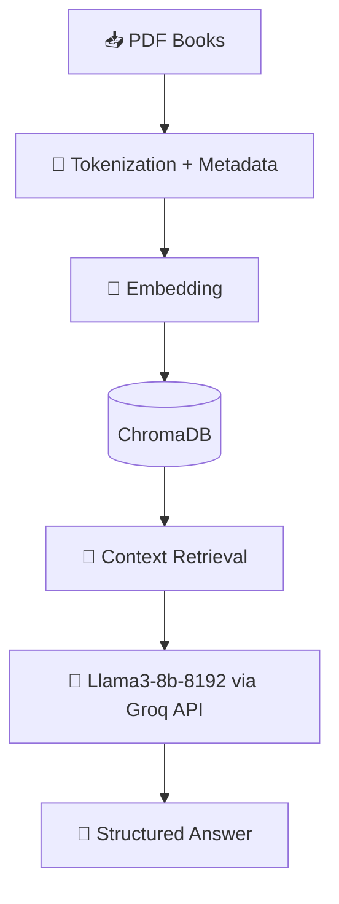

# 📚 RAG Pipeline for NCERT Class 10 Books

A Retrieval-Augmented Generation (RAG) project built using **Groq API** and **Llama3-8b-8192**, designed for efficient question answering from NCERT Class 10 textbooks.

---

## ✨ Features
- 🔍 Tokenized multiple NCERT Class 10 books with metadata  
- 📖 Subjects included:  
  - Mathematics (1 book)  
  - Social Science (4 books)  
  - English (3 books)  
  - Health & Physical Education (1 book)  
  - Science (1 book)  
- 🧩 Embedded all tokens and stored them in **ChromaDB**  
- 🤖 RAG pipeline for **context retrieval + answer generation**  
- ⚡ Powered by **Groq API** with **Llama3-8b-8192**  

---

## 🛠️ Tech Stack

<div align="center">

[](https://www.python.org/)  
[](https://www.trychroma.com/)  
[](https://groq.com/)  
[](https://ai.meta.com/llama/)  

</div>

---

## 📂 Project Structure

```
📦 rag-ncert-project
 ┣ 📜 ingest.py         # PDF ingestion, tokenization & metadata handling
 ┣ 📜 embed.py          # Embedding tokens & storing in ChromaDB
 ┣ 📜 rag_pipeline.py   # RAG pipeline with Groq API & Llama3
 ┣ 📜 utils.py          # Helper functions
 ┗ 📜 README.md         # Project documentation
```

---

## 🚀 How It Works

1. 📥 **Ingest PDFs** → Extracted text + metadata  
2. 🧮 **Tokenize & Embed** → Stored vector embeddings in ChromaDB  
3. 🔎 **Retrieve Context** → Relevant chunks fetched per query  
4. 🧠 **Generate Answer** → Groq API (Llama3-8b-8192) produces structured response  

---

## 📊 Visualization of Workflow



---

## 📦 Installation & Usage

```bash
# Clone repo
git clone https://github.com/your-username/rag-ncert-project.git
cd rag-ncert-project

# Install dependencies
pip install -r requirements.txt

# Run ingestion
python ingest.py

# Run RAG pipeline
python rag_pipeline.py
```

---

## 🔮 Future Improvements
- 📊 Dashboard for visualizing embeddings  
- 🌐 API endpoints for integration  

---

## 🤝 Contributing
Pull requests welcome! For major changes, please open an issue first.
star the repository if you find it helpful.


---

<div align="center">

💡 *Made with ❤️ using Groq + Llama3* 💡

</div>
 
