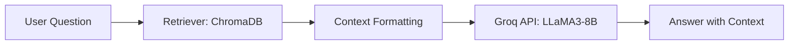

# 📚 NCERT Class 10 RAG QA System

An end-to-end Retrieval-Augmented Generation (RAG) pipeline built on **NCERT Class 10 books** using **ChromaDB** for vector storage and **Groq API (LLaMA 3 8B)** for question answering.

---

## ✨ Project Overview

This project enables conversational QA over NCERT Class 10 books across multiple subjects.  
The pipeline retrieves the most relevant book chunks from a vector database and generates structured answers with proper context.

---

## 📖 Subjects & Books Included

- **Mathematics** (1 book)
- **Social Science** (4 books)
- **English** (3 books)
- **Science** (1 book)
- **Health & Physical Education** (1 book)

Total: **10 NCERT Class 10 Books** embedded.

---

## ⚙️ Workflow

```mermaid
graph TD;
    A[PDF Books] -->|Tokenization + Metadata| B[Text Chunks]
    B -->|Embeddings (MiniLM)| C[ChromaDB]
    C -->|Retriever| D[RAG Pipeline]
    D -->|Query + Context| E[Groq LLaMA3-8B]
    E -->|Answer| F[User]
```

---

## 🛠️ Scripts

### 🔹 `embedding.py`
- Tokenizes text chunks
- Adds metadata (subject, book, etc.)
- Generates embeddings using **SentenceTransformer (MiniLM)**
- Stores vectors + metadata in **ChromaDB**

### 🔹 `rag_pipeline.py`
- Retrieves top-k relevant chunks with metadata
- Formats context neatly (with subject/book info)
- Sends prompt + context to **Groq API**
- Returns structured, conclusive answers

---

## 🚀 Features

- ✅ Retrieval with **ChromaDB**
- ✅ Context-aware answers with **Groq LLaMA3-8B**
- ✅ Clean, wrapped context display with subject/book reference
- ✅ Extendable (add chapters/pages as metadata)
- ✅ Ready for front-end integration (Streamlit/React)

---

## 🧑‍💻 Usage

### 1️⃣ Build embeddings
```bash
python embedding.py
```

### 2️⃣ Run RAG pipeline
```bash
python rag_pipeline.py
```

Enter your question interactively and get:  
- 📖 Retrieved Context (neatly formatted)  
- 🤖 LLM Answer (structured in 3–5 sentences)

---

## 🎨 Example Output

```
📖 Retrieved Context:

Context 1 [socialscience | democraticpolitics4]
Gender division is a form of hierarchical social division seen everywhere, but is rarely
recognised in the study of politics. The gender division tends to be understood as natural...

🤖 LLM Answer:
Gender division refers to unequal roles given to men and women in society. The text explains
that it is seen as natural, but actually arises from social expectations. In conclusion, it
remains a key issue in Indian democracy.
```

---

## 🔮 Future Work
- Add **chapter & page metadata**
- Build a **Streamlit/React frontend**
- Deploy with **Docker + Render/Spaces**

---

## 💡 Visualization



---

## 👨‍💻 Author
**Mir Asim Ali**  
AI/ML Research Project Intern | IIIT Hyderabad  

---

⭐ If you found this project useful, feel free to star it!  
